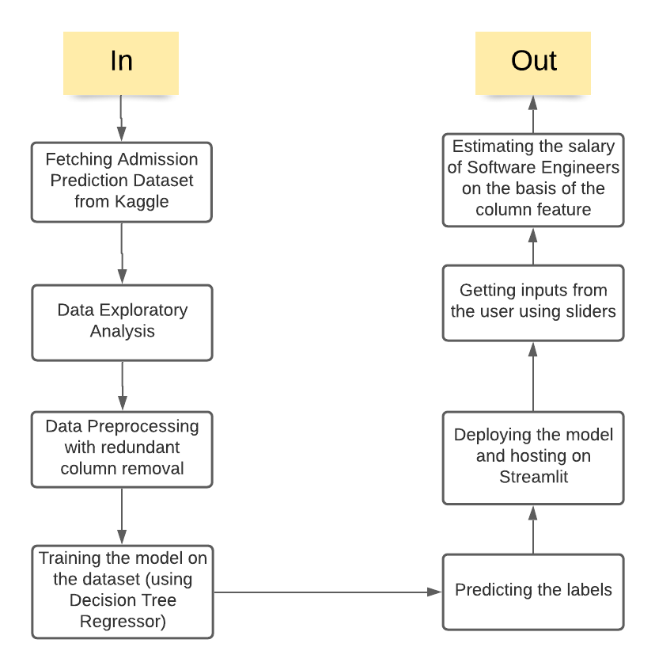

# Salary-Estimation-of-Full-time-Engineers-with-Decision-Tree-Regressor

Link: https://share.streamlit.io/aaryamansingla/salary-estimation-of-full-time-software-engineers-with-random-forest-regressor/app.py

## Introduction to the project
To estimate the salary of a software engineer, one needs to input the country they belong to, the qualifications and the number of years of experience.

## HOW TO USE THE DEPLOYED MODEL
Use the slider to input the different values of Country, Education level and Years of experience using the slider provided for each individual category
[For reference, check input-output screenshot folder in the repository]

Dataset Link: https://insights.stackoverflow.com/survey

## Used libraries
In this project, the dataset is trained on Random Forest Regressor machine learning model. Used libraries: 
* `pandas` for data manipulation 
* `Seaborn` and `Matplotlib` for data visualisation
* `Sklearn` for training the model and deriving the errors and accuracy.
* `pickle` module to dump the model to save and load it
* `streamlit` library for deployment and hosting

## Methodology used
1. Fetching Salary Prediction Dataset from Stack Overflow
2. Data Exploratory Analysis
3. Data Preprocessing with redundant column removal
4. Training the model on the dataset
5. Predicting the labels
6. Evaluation using regression metrics 
7. Deploying the model and hosting on Streamlit
8. Getting inputs from the user using sliders
9. Estimating the salary on the basis of the column feature

